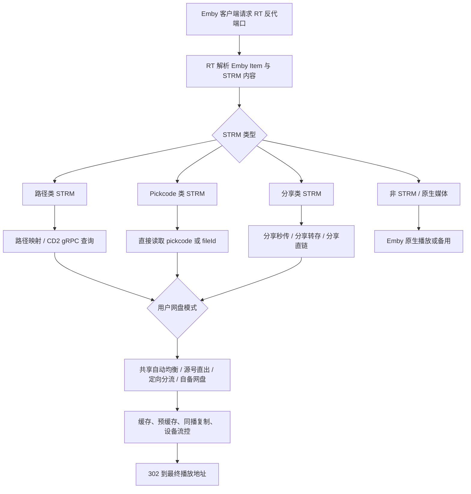

# Emby 播放全场景

ResourceTool 的 Emby 播放网关负责接管客户端播放请求，根据 STRM 内容识别资源类型，再结合用户的网盘模式选择出链账号，最终返回 115 直链、分享直链或 Emby 原生播放。

这页按实际播放决策重构：**先看 STRM 类型，再看网盘模式，最后看加速、缓存、流控和兜底策略**。

## 总览



::: important 接入前提
Emby 客户端必须连接 RT 配置的**反代端口**，不能直接连接 Emby 原始端口。只有经过 RT 网关的请求，才能触发 STRM 识别、302 出链、缓存和用户网盘模式判断。
:::

## 前后端配置入口

| 目标 | 前端入口 | 后端逻辑 |
|------|----------|----------|
| 创建播放网关 | **概览 → Emby 助手 → 新增配置** | 保存 Emby 地址、API Key、反代端口和默认 115 账号 |
| 配置 STRM 识别 | Emby 助手配置卡 → **播放模式 / 路径映射** | 按 STRM 内容匹配路径、pickcode、分享链接或原生播放 |
| 配置用户网盘模式 | **开服 → 实例管理 → 权限模板**，或 **开服 → Emby 用户** | 播放时读取用户模式，决定使用共享账号、自备账号或原生链路 |
| 配置 115 账号 | **网盘 → 115 助手** | 管理内置账号、自备账号、Cookie、同播复制和清理任务 |
| 查看播放缓存 | **概览 → 缓存管理** | 展示直链缓存、预缓存来源、用户、Host、UA 和剩余时间 |
| 管理设备和会话 | **开服 → 活跃设备**，Emby 助手流控配置 | 限制并发设备，终止异常播放，屏蔽指定 UA |

## 创建 Emby 播放网关

进入 **概览 → Emby 助手**，点击 **新增配置**。

| 配置项 | 说明 |
|--------|------|
| **配置名称** | 自定义名称，如 `Emby 家庭服` |
| **Emby 内网地址** | Emby 原始服务地址，如 `http://192.168.5.5:8096` |
| **Emby API Key** | 在 Emby 管理后台的 API 密钥中获取 |
| **反代端口** | 客户端实际连接端口，如 `18096` |
| **115 账号** | 默认播放账号，也用于文件路径查询和共享模式出链 |

::: caution
反代端口不能与 Emby 原始端口相同。配置后，客户端服务器地址应填写 RT 网关地址和反代端口。
:::

## 按 STRM 类型划分

RT 会读取 Emby 返回的媒体路径或 STRM 内容，并按以下顺序识别。一个媒体库可以混合多种 STRM 类型，只要对应模式已开启即可。

### 1. 路径类 STRM

适合通过 CloudDrive2、Rclone、Alist、NAS 挂载等方式生成的媒体库。STRM 内容通常是本地路径、挂载路径或 CD2 cloud strm URL。

```text
/115open/Symedia媒体库/电影.mkv
/mnt/115/媒体库/电影/电影.mkv
http://cd2:29798/static/http/.../False//115open/媒体库/电影.mkv
```

路径类 STRM 的处理链路：

| 步骤 | 说明 |
|------|------|
| **路径匹配** | 用路径映射规则判断该路径属于哪个 115 配置 |
| **CD2 加速** | 已配置 CloudDrive2 时，优先通过 gRPC 查询 pickcode |
| **115 API 查询** | CD2 不可用或未配置时，按路径向 115 查询文件 |
| **进入网盘模式** | 拿到源账号和文件信息后，再根据用户模式决定最终出链账号 |

路径映射规则格式：

```text
/CloudNAS/CloudDrive/115open => 115-主号
/mnt/115 => 115-主号
http://cd2:29798/static/http/.../False//115open => 115-主号
# 井号开头为注释
```

点击「自动生成路径映射」后，可粘贴 STRM 内容让系统自动匹配 115 配置名。

### 2. Pickcode 类 STRM

适合直接把 115 文件标识写进 STRM 的媒体库。无需路径映射，播放时直接从参数中取 `pickcode` 或 `fileId`。

```text
http://host/api/?pickcode=abc&name=电影.mkv
http://host/videoPlayUrl?pickcode=abc&account=115-主号
http://host/videoPlayUrl?fileId=123456&account=115-主号
```

Pickcode 类 STRM 的处理链路：

| 步骤 | 说明 |
|------|------|
| **解析参数** | 从 URL 中提取 pickcode、fileId、account、name 等信息 |
| **定位源号** | STRM 指定 account 时优先使用指定账号，否则使用实例默认 115 账号 |
| **秒传映射** | 共享自动均衡或定向分流时，可秒传到目标账号再出链 |
| **缓存结果** | 出链成功后写入 URL 缓存，后续播放可直接命中 |

秒传映射示例：

```text
115-主号 => 115-副号
115-主号 => 115-副号A, 115-副号B
# 右侧留空表示不秒传，源号直出
```

### 3. 分享类 STRM

适合 STRM 中保存 115 分享信息，或资源暂未转存到本地账号的场景。

```text
http://host/api/?share_code=xxx&receive_code=yyy&id=12345&name=电影.mkv
http://host/shareVideoPlayUrl?shareCode=xxx&password=yyy&fileId=zzz&fileName=电影.mkv
```

分享类 STRM 的三级兜底：

```text
分享秒传 -> 分享转存 -> 分享直链
```

| 级别 | 说明 |
|------|------|
| **分享秒传** | 通过 SHA1 秒传到目标账号，速度最快 |
| **分享转存** | 秒传失败时通过分享接收接口转存到目标账号 |
| **分享直链** | 转存失败时直接通过分享下载接口获取播放地址 |

配置多个分享副号时，系统会随机选择并在失败后尝试下一个，分摊账号压力。分享转存产生的临时文件会在缓存过期后自动清理。

### 4. Emby 原生媒体

非 STRM 文件、路径无法识别、115 出链失败或用户设置为原生播放时，会进入 Emby 原生链路。

| 配置状态 | 行为 |
|----------|------|
| **开启原生播放** | 不启用 302 模式时，直接走 Emby 原始播放 |
| **原生作为备用** | 115 直链失败后回退到 Emby |
| **关闭原生播放** | 302 出链失败时直接返回错误 |

::: tip
如果你的 Emby 服务器没有真实媒体文件，只有 STRM 文件，建议不要依赖原生播放作为最终兜底。
:::

## 按网盘模式划分

STRM 类型决定“资源从哪里来”，网盘模式决定“最终用谁的账号出链”。网盘模式来自实例默认权限模板、邀请码、用户编辑页或用户自助切换。

| 网盘模式 | 出链账号 | 适合场景 |
|----------|----------|----------|
| **共享自动均衡** | 管理员内置 115 账号池 | 多账号负载均衡，普通开服默认推荐 |
| **共享源号直出** | STRM 或路径对应的源 115 账号 | 资源分散在多个账号，不希望额外秒传 |
| **共享定向分流** | 管理员指定的目标 115 账号 | 给某批用户固定分配账号，方便控量 |
| **自备网盘** | 用户绑定的自备 115 Cookie | 大规模开服，用户自己承担播放账号压力 |
| **原生播放** | Emby 服务器 | 本地盘媒体、测试账号或不走 115 的用户 |

### 共享自动均衡

共享自动均衡会根据实例秒传规则和可用账号，在内置 115 账号之间选择目标账号。适合管理员统一维护账号池的场景。

处理逻辑：

1. 根据 STRM 类型找到源文件。
2. 按秒传映射选择一个目标账号。
3. 目标账号已有文件则直接出链；没有则尝试秒传。
4. 秒传失败时根据 STRM 类型进入分享兜底或源号直出策略。

### 共享源号直出

源号直出不改变文件所在账号。路径类 STRM 会使用路径映射命中的 115 配置，Pickcode 类 STRM 会使用 URL 中指定的 account 或实例默认账号。

这种模式 API 调用更少，但同一源号承受全部播放压力。

### 共享定向分流

定向分流会把用户固定绑定到指定目标账号，播放时优先秒传到该账号再出链。它适合按用户等级、地区或套餐做账号隔离。

在 **Emby 用户** 页面可以按 115 账号筛选用户，快速查看某个源号、目标号、自备号或定向分流账号关联了哪些用户。

### 自备网盘

自备模式要求用户在用户面板或 Emby Bot 中绑定自己的 115 Cookie。播放时仍然按 STRM 类型找到源文件，但最终尽量使用用户自己的 115 账号出链。

| 能力 | 说明 |
|------|------|
| **Cookie 绑定** | 用户可在用户面板或 Bot 中更新 Cookie 和回收站密码 |
| **分享播放** | 自备用户同样支持分享秒传、分享转存和分享直链 |
| **缓存隔离** | 直链缓存记录用户和账号信息，避免串用 |
| **健康提示** | Cookie 失效时，用户面板会展示失败原因 |

### 原生播放

原生播放会跳过 115 直链流程，由 Emby 按自身能力播放。适合本地盘媒体、管理员测试、风控期间临时降级，或不允许用户使用 115 的账号。

## CD2 加速

CloudDrive2 通过 gRPC 查询 115 文件信息，主要服务于路径类 STRM。配置入口在 **概览 → 插件库 → CloudDrive2 助手**。

| 配置项 | 说明 |
|--------|------|
| **CD2 地址** | CloudDrive2 服务地址，如 `http://192.168.1.100:19798` |
| **用户名 / 密码** | CD2 登录凭据 |
| **Emby 路径前缀** | Emby 媒体库路径，如 `/mnt/media/` |
| **CD2 挂载路径** | CD2 内的 115 挂载路径，如 `/115/media/` |

系统会把 `/mnt/media/movie.mkv` 转换为 `/115/media/movie.mkv`，再通过 CD2 gRPC 查询 pickcode。编辑 Emby 实例时，在路径替换模式中选择对应 CD2 实例即可启用。

| 场景 | 无预缓存 | 有预缓存 |
|------|----------|----------|
| 路径模式 + CD2 | 约 353ms | 约 0ms |
| Pickcode 模式 | 约 550ms | 约 0ms |
| 路径模式无 CD2 | 约 1130ms | 约 0ms |

## 缓存与预缓存

### URL 缓存

在 Emby 助手配置卡的「流控配置」中设置缓存有效期，范围为 5 分钟到 2 小时，默认 30 分钟。

缓存管理页会展示：

| 字段 | 说明 |
|------|------|
| **115 配置** | 本次出链使用的账号 |
| **缓存来源** | 正常播放或预缓存 |
| **剩余时间** | 缓存倒计时 |
| **播放文件** | 媒体名称和路径 |
| **Emby 用户** | 触发缓存的用户 |
| **Host / UA** | 客户端访问来源和播放器标识 |

### 预缓存

预缓存会在用户真正播放前提前获取直链，降低点击播放后的等待时间。

| 触发入口 | 场景 | 控制机制 |
|----------|------|----------|
| **PlaybackInfo** | 用户点击播放按钮 | 令牌桶限速 |
| **详情页** | 用户打开影片详情 | 速率检测和冷却期 |
| **剧集系列** | App 打开剧集卡片 | 流控检测 |

| 媒体类型 | 默认预缓存版本数 | 说明 |
|----------|------------------|------|
| **电影** | 2 | 按码率从高到低取前 2 个版本 |
| **剧集** | 1 | 降低 115 API 调用量 |

被设备流控拦截的用户不会触发预缓存，避免浪费 API 调用额度。

## 设备流控与 UA 屏蔽

设备流控限制每个 Emby 用户同时使用的客户端数量。它只作用于登录认证、播放信息获取和视频播放，浏览媒体库、加载海报、搜索和查看详情不受影响。

| 配置位置 | 说明 |
|----------|------|
| **开服安全配置** | 设置全局默认设备数上限 |
| **实例权限模板** | 设置新用户或批量套用时的设备策略 |
| **Emby 用户** | 为单个用户覆盖设备数，`0` 表示不限制 |

双层超时机制：

| 层级 | 超时时间 | 效果 |
|------|----------|------|
| **空闲超时** | 5 分钟 | 设备可被新设备替换 |
| **完全过期** | 30 分钟 | 设备从在线列表中移除 |

UA 屏蔽在 Emby 助手配置卡的「流控配置」中设置。启用后，一行一个 UA 关键字，命中后返回 403；管理员和 UA 白名单用户会跳过该限制。

## 同播复制

115 对同一文件的并发下载存在限制。多个用户同时播放同一个 pickcode 时，同播复制会给后续用户创建文件副本，让每个用户拿到独立直链。

触发链路：

```text
用户 A 正在播放文件 X
用户 B 请求播放同一文件 X
系统检测到不同用户播放同一 pickcode
为用户 B 创建临时副本并出链
缓存过期后清理副本和回收站
```

配置入口在 **网盘 → 115 助手 → 内置账号**：

| 配置项 | 说明 |
|--------|------|
| **同播复制** | 开关，适合多用户共享账号 |
| **临时目录** | 副本文件存储目录，默认 `/ResourceTool` |
| **自动清理** | 定时清理临时文件和回收站 |

同播复制覆盖缓存命中、CD2 快速路径和 115 API 路径。同一用户的重复请求不会触发复制。

## 兜底顺序

不同 STRM 类型的兜底策略略有差异，但整体目标一致：尽量让用户播放成功，同时控制 115 API 压力。

| 场景 | 兜底顺序 |
|------|----------|
| **路径类 STRM** | 缓存 -> CD2 查询 -> 115 路径查询 -> 秒传/出链 -> 原生备用 |
| **Pickcode 类 STRM** | 缓存 -> pickcode 出链 -> 秒传映射 -> 源号直出 -> 原生备用 |
| **分享类 STRM** | 缓存 -> 分享秒传 -> 分享转存 -> 分享直链 -> 原生备用 |
| **自备用户** | 用户自备账号优先，失败后按管理员允许的共享或原生策略兜底 |
| **原生用户** | 跳过 115，直接走 Emby 原始链路 |

## 关联能力

| 能力 | 文档 |
|------|------|
| 115 账号、同播复制、Cookie 健康检查 | [115 云盘配置](/features/pan115/) |
| 用户网盘模式、权限模板、自备 Cookie | [Emby 用户管理](/features/emby-users/) |
| 实例 Bot、运营模式、媒体库管控 | [实例管理](/features/emby-instances/) |
| 访问线路、在线会话、终止播放 | [访问线路与会话管理](/features/emby-lines/) |
| 注册、邀请码、默认网盘模式 | [开服安全配置](/features/emby-security/) |
